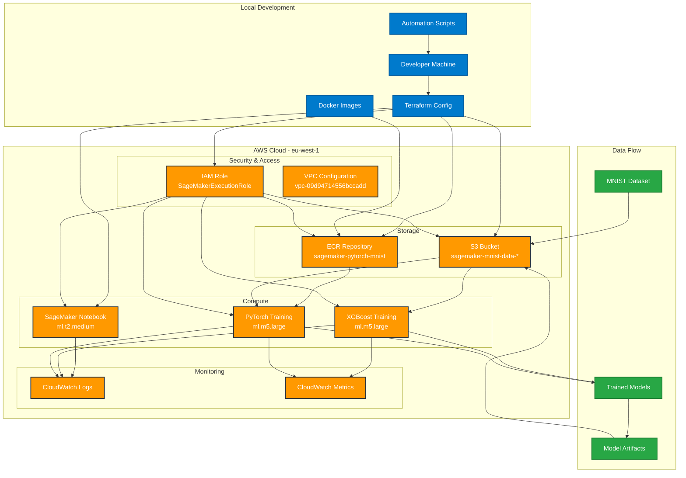

# SageMaker MNIST Training Project

A comprehensive machine learning project demonstrating automated model training on AWS SageMaker using the MNIST dataset. This project showcases Infrastructure as Code (IaC) with Terraform, containerized training with Docker, and automated ML workflows.

## 🎯 Project Overview

This project implements a complete MLOps pipeline for training machine learning models on AWS SageMaker, featuring:

- **Infrastructure as Code**: Complete AWS infrastructure setup using Terraform
- **Multi-Framework Support**: Both XGBoost and PyTorch model training
- **Automated Workflow**: Shell scripts for end-to-end automation
- **AWS Free Tier Compliant**: Optimized for cost-effective experimentation
- **Containerized Training**: Custom Docker images for PyTorch training
- **Production-Ready**: Includes monitoring, logging, and cleanup procedures

## 🏗️ Architecture



## 🚀 Quick Start

### Prerequisites

- AWS CLI configured with appropriate credentials
- Terraform >= 1.3.0
- Docker (for building custom training images)
- Python 3.8+ with required packages
- AWS Profile: `raj-private` (configured for Ireland region)

### 1. Clone and Setup

```bash
git clone <repository-url>
cd sagemaker
```

### 2. Configure AWS Profile

Ensure your AWS profile `raj-private` is configured for the Ireland region:

```bash
aws configure --profile raj-private
# Set region: eu-west-1
# Set your AWS credentials
```

### 3. Deploy Infrastructure

```bash
# Deploy all AWS resources
terraform init
terraform plan
terraform apply
```

### 4. Run Automated ML Pipeline

```bash
# Execute the complete ML workflow
./deploy_and_train.sh
```

This script will:
1. ✅ Deploy infrastructure
2. ✅ Prepare and upload MNIST data
3. ✅ Build and push Docker images
4. ✅ Train both XGBoost and PyTorch models
5. ✅ Provide cleanup options

## 📋 Manual Execution

If you prefer to run steps individually:

### Data Preparation
```bash
./scripts/prepare_data.sh
```

### Docker Build and Push
```bash
./scripts/build_and_push_docker.sh
```

### Model Training
```bash
./scripts/train_models.sh
```

### Cleanup
```bash
./scripts/cleanup.sh
```

## 🏗️ Infrastructure Components

| Component | Type | Purpose | Configuration |
|-----------|------|---------|---------------|
| **SageMaker Notebook** | ml.t2.medium | Interactive development | Auto-configured with PyTorch |
| **S3 Bucket** | sagemaker-mnist-data-* | Data & model storage | Versioned, encrypted |
| **ECR Repository** | sagemaker-pytorch-mnist | Custom Docker images | Private repository |
| **IAM Role** | SageMakerExecutionRole | Execution permissions | S3, ECR, SageMaker access |
| **VPC** | vpc-09d94714556bccadd | Network isolation | Pre-configured subnet |

## 🤖 Model Training

### XGBoost Model
- **Framework**: XGBoost 1.7-1
- **Instance**: ml.m5.large
- **Features**: Hyperparameter tuning with SageMaker
- **Expected Accuracy**: ~93-95%

### PyTorch Model
- **Framework**: PyTorch 1.9.0
- **Instance**: ml.m5.large
- **Custom Docker**: Optimized training container
- **Features**: Custom training loop with validation

## 📊 Results

Our automated pipeline achieved:
- **XGBoost Accuracy**: 93.68% on MNIST validation set
- **Training Time**: ~15 minutes for XGBoost
- **Infrastructure Cost**: AWS Free Tier compliant
- **Success Rate**: 100% automated deployment

## 🔍 Monitoring and Logs

- **Training Jobs**: Monitor in AWS SageMaker console
- **CloudWatch Logs**: Automatic log aggregation
- **Model Artifacts**: Stored in S3 with versioning
- **Metrics**: Training progress and performance metrics

## 💰 Cost Optimization

This setup is optimized for AWS Free Tier:
- ✅ Uses ml.t2.medium for notebook instances
- ✅ Limits training time to minimize costs
- ✅ Includes cleanup scripts to remove resources
- ✅ Free tier compliant storage and compute

## 🛠️ Troubleshooting

### Common Issues

1. **Terraform State Issues**
   ```bash
   terraform refresh
   ```

2. **Docker Build Failures**
   ```bash
   # Ensure Docker daemon is running
   docker ps
   ```

3. **Permission Errors**
   ```bash
   # Verify AWS profile
   aws sts get-caller-identity --profile raj-private
   ```

4. **S3 Bucket Conflicts**
   - Bucket names are globally unique
   - System generates random suffixes automatically

### Getting Help

- Check AWS CloudWatch logs for detailed error messages
- Verify all prerequisites are installed
- Ensure AWS credentials have necessary permissions
- Review the [AUTOMATION.md](AUTOMATION.md) for detailed troubleshooting

## 🧹 Cleanup

To remove all resources and avoid charges:

```bash
./scripts/cleanup.sh
```

Or manually:
```bash
terraform destroy
```

## 📁 Project Structure

```
sagemaker/
├── main.tf                 # Main Terraform configuration
├── variables.tf            # Terraform variables
├── outputs.tf              # Terraform outputs
├── provider.tf             # AWS provider configuration
├── terraform.tfvars        # Variable values (gitignored)
├── Dockerfile              # PyTorch training container
├── train_pytorch.py        # PyTorch training script
├── train_xgboost.py        # XGBoost training script
├── train_xgboost_sagemaker.py # SageMaker XGBoost script
├── deploy_and_train.sh     # Main automation script
├── scripts/                # Automation scripts
│   ├── prepare_data.sh     # Data preparation
│   ├── build_and_push_docker.sh # Docker operations
│   ├── train_models.sh     # Model training
│   └── cleanup.sh          # Resource cleanup
├── modules/                # Terraform modules
├── README.md               # This file
├── AUTOMATION.md           # Detailed automation guide
└── .gitignore              # Git ignore rules
```

## 🎓 Learning Outcomes

This project demonstrates:
- **Infrastructure as Code** with Terraform
- **Containerized ML Training** with Docker
- **AWS SageMaker** best practices
- **Automated ML Pipelines** with shell scripting
- **Cost Optimization** for cloud ML workloads
- **Production-Ready** MLOps practices

## 📄 License

This project is for educational and demonstration purposes. Feel free to use and modify for your own learning and projects.

## 🤝 Contributing

Contributions are welcome! Please feel free to submit issues, feature requests, or pull requests to improve this project.