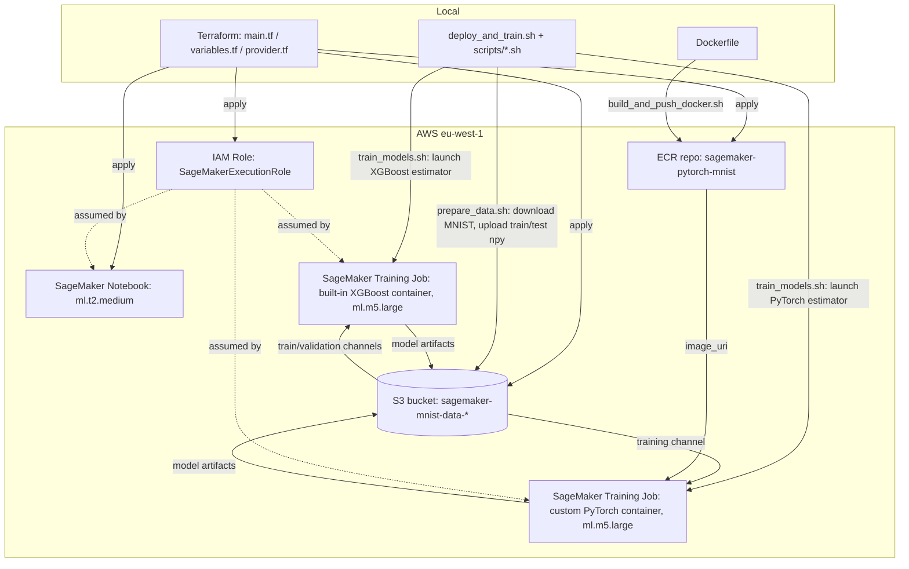

# AWS SageMaker MNIST Training Pipeline

Terraform provisions the S3 bucket, IAM role, ECR repository and a SageMaker notebook instance; shell scripts then drive the actual training. It trains an MNIST digit classifier two ways: a built-in SageMaker XGBoost estimator, and a PyTorch CNN trained inside a custom Docker container pushed to ECR. I built this to get hands-on with the SageMaker training/estimator API and with wiring Terraform outputs into a shell-script deployment flow, not as a template for a real production ML pipeline.

There is no CI pipeline. There's no GitHub Actions workflow in this repo — building the Docker image, pushing it to ECR, and kicking off training jobs are all manual steps run from a laptop against a named AWS CLI profile.

## Architecture


```mermaid
flowchart TD
    subgraph Local
        TF[Terraform: main.tf / variables.tf / provider.tf]
        DOCKERFILE[Dockerfile]
        SCRIPTS[deploy_and_train.sh + scripts/*.sh]
    end

    subgraph AWS["AWS eu-west-1"]
        IAM[IAM Role: SageMakerExecutionRole]
        S3[(S3 bucket: sagemaker-mnist-data-*)]
        ECR[ECR repo: sagemaker-pytorch-mnist]
        NB[SageMaker Notebook: ml.t2.medium]
        XGB[SageMaker Training Job: built-in XGBoost container, ml.m5.large]
        PT[SageMaker Training Job: custom PyTorch container, ml.m5.large]
    end

    TF -->|apply| IAM
    TF -->|apply| S3
    TF -->|apply| ECR
    TF -->|apply| NB

    DOCKERFILE -->|build_and_push_docker.sh| ECR

    SCRIPTS -->|prepare_data.sh: download MNIST, upload train/test npy| S3
    SCRIPTS -->|train_models.sh: launch XGBoost estimator| XGB
    SCRIPTS -->|train_models.sh: launch PyTorch estimator| PT

    S3 -->|train/validation channels| XGB
    S3 -->|training channel| PT
    ECR -->|image_uri| PT

    XGB -->|model artifacts| S3
    PT -->|model artifacts| S3

    IAM -.assumed by.-> NB
    IAM -.assumed by.-> XGB
    IAM -.assumed by.-> PT
```

The notebook instance and the two training jobs all assume the same `SageMakerExecutionRole`. Its inline policy (`SageMakerFreeTierPolicy` in `main.tf`) grants S3 read/write, ECR pull/push, SageMaker training/tuning, and CloudWatch logging — all with `Resource: "*"` rather than scoped to the specific bucket and repository ARNs it actually needs. That's fine for a personal sandbox account, but it's the kind of thing I'd tighten before using this pattern anywhere shared.

The XGBoost path uses the SageMaker-managed XGBoost container with `train_xgboost_sagemaker.py` as the entry point — no custom image needed. The PyTorch path is the reason the Dockerfile and ECR repo exist at all: `train_pytorch.py` (a small CNN) is baked into a custom image at `/opt/ml/code/train.py`, built and pushed to ECR by `scripts/build_and_push_docker.sh`, then referenced by `image_uri` when the PyTorch estimator is created. Both training jobs actually run on `ml.m5.large` (see `scripts/train_models.sh`), not the `ml.t2.medium` the notebook instance uses — the two are configured independently, so it's worth calling out explicitly rather than assuming everything here is free-tier eligible, since `ml.m5.large` is not.

## What's missing

- No CI. No `.github/workflows` directory exists in this repo.
- No automated tests. Nothing here is covered by pytest or similar; correctness was checked by running training manually and reading the SageMaker console output.
- `scripts/train_models.sh` writes out a temporary `run_training.py` on every run and deletes it afterward, which works but means the "real" training code that actually gets executed only exists transiently on disk during a run.
- `train_xgboost.py` and `run_pytorch_training.py` at the repo root are earlier standalone drafts of the same training logic that now lives in `scripts/train_models.sh`. They are not called by `deploy_and_train.sh` or any other script and are left in the repo mostly for reference; running them directly would train against a literal `sagemaker-mnist-data` bucket name rather than the one Terraform actually creates.
- `variables.tf` declares `vpc_id`, `subnet_id`, `notebook_instance_name`, and `notebook_role_arn`, and there's an entire `modules/sagemaker_notebook` module for a VPC-attached notebook instance with its own security group — none of it is referenced from `main.tf`. The notebook instance that actually gets created is defined directly in `main.tf` and doesn't use a VPC at all.
- The IAM policy attached to `SageMakerExecutionRole` uses `Resource: "*"` for S3/ECR/SageMaker actions instead of being scoped to the specific bucket and repo ARNs.
- AWS profile (`raj-private`) and region (`eu-west-1`) are hardcoded across the shell scripts, `provider.tf`, and the training scripts rather than being parameterized.
- `scripts/cleanup.sh` runs `terraform destroy` but says outright that you may need to manually remove leftover S3 objects or ECR images — it isn't a guaranteed full teardown.
- No monitoring or alerting beyond whatever CloudWatch collects by default for SageMaker jobs.

## Project structure

```
main.tf                        # S3 bucket, IAM role/policy, notebook instance + lifecycle config, ECR repo
variables.tf                   # Root variables — includes some (vpc_id, subnet_id, etc.) unused by main.tf
outputs.tf                     # Bucket name, ECR URI, role ARN, notebook ARN/URL
provider.tf                    # AWS provider, pinned to eu-west-1 and the raj-private profile
modules/sagemaker_notebook/    # Standalone VPC-attached notebook module, not called from main.tf
Dockerfile                     # Custom PyTorch training container, copies train_pytorch.py into /opt/ml/code/train.py
train_pytorch.py               # CNN + training loop, used as the entry point inside the Docker image
train_xgboost_sagemaker.py     # XGBoost training entry point run inside SageMaker's built-in container
train_xgboost.py               # Earlier standalone XGBoost driver script, not wired into deploy_and_train.sh
run_pytorch_training.py        # Earlier standalone PyTorch driver script, not wired into deploy_and_train.sh
deploy_and_train.sh            # Orchestrates: terraform apply -> prepare_data -> build_and_push_docker -> train_models
scripts/prepare_data.sh        # Downloads MNIST via torchvision, uploads train/validation .npy files to S3
scripts/build_and_push_docker.sh # Builds the Docker image and pushes it to ECR
scripts/train_models.sh        # Reads Terraform outputs, launches the XGBoost and PyTorch training + tuning jobs
scripts/cleanup.sh             # Stops the notebook instance, runs terraform destroy
AUTOMATION.md                  # Longer write-up of what each script does
```

## How to run this

Requires Terraform >= 1.3.0, the AWS CLI, Docker, and Python 3.8+ with `sagemaker`/`torch`/`torchvision` installed locally. Everything assumes an AWS CLI profile named `raj-private` configured for `eu-west-1` — change that in `provider.tf` and the scripts if you're using this yourself.

```bash
git clone https://github.com/soodrajesh/AWS-Sagemaker-MLOps-Pipeline.git
cd AWS-Sagemaker-MLOps-Pipeline

# Provision the S3 bucket, IAM role, ECR repo, and notebook instance
terraform init
terraform apply

# Run the full flow: build/push the Docker image, upload MNIST to S3, launch both training jobs
./deploy_and_train.sh
```

Or run each stage by hand:

```bash
./scripts/prepare_data.sh          # download MNIST, upload to the S3 bucket from terraform output
./scripts/build_and_push_docker.sh # build the PyTorch training image and push to ECR
./scripts/train_models.sh          # launch the XGBoost and PyTorch training + tuning jobs
```

Training progress and results are visible in the SageMaker console (Training jobs / Hyperparameter tuning jobs), not through anything in this repo. When you're done:

```bash
./scripts/cleanup.sh
# or, manually:
terraform destroy
```
